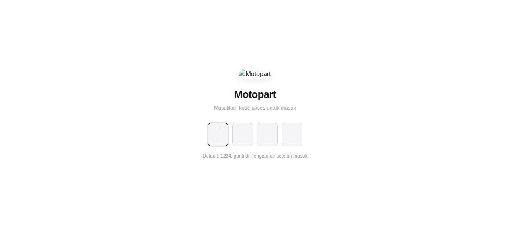

# 🔧 Motopart: Tracker Sparepart Motor

Aplikasi PWA untuk tracking sparepart motor, service history, dan pengelolaan data kendaraan dalam satu antarmuka.

> **Akses cepat dengan PIN. Data tersimpan lokal di browser.**

## ✨ Fitur Utama

| Fitur | Keterangan |
|--|--|
| 🔐 PIN Access | Login cepat dengan kode akses |
| 🔧 Sparepart Tracking | Catat sparepart yang dibeli, tgl, harga, lokasi |
| 🛠️ Service History | Riwayat servis motor dengan catatan |
| 🛞 Vehicle Data | Data kendaraan + odometer |
| 📱 PWA | Install seperti app di HP |
| 🔒 Offline | Data di localStorage, tanpa login server |
| ⚙️ Settings | Ganti PIN default setelah masuk |

## 🛠️ Cara Pakai
1. Buka [motopart.zwart.qzz.io](https://motopart.zwart.qzz.io)
2. Masukkan PIN default: `1234`
3. Ganti PIN di Pengaturan setelah masuk
4. Input sparepart dan service history
5. Semua data tersimpan otomatis

## 📄 Lisensi
MIT